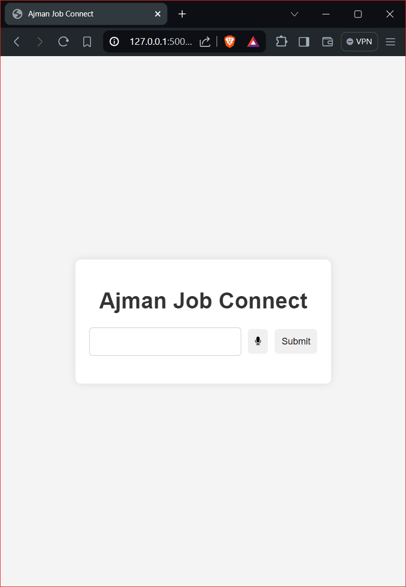

# Ajman Job Connect

Ajman Job Connect is a web application that allows users to search for job recommendations based on text input or voice commands. It integrates a recommendation system that matches job titles with available opportunities from a MongoDB database.

## Features

- **Text Input Search:** Users can manually enter job titles to get recommendations.
- **Voice Input Search:** Users can use voice commands to search for job titles, which are transcribed and processed into recommendations.
- **Job Recommendations:** Displays job recommendations including title, description, company, location, and relevance score.
- **Responsive Design:** The web interface is designed to be responsive and user-friendly.

## Technologies Used

- **Frontend:** HTML, CSS, JavaScript (Vanilla JS)
- **Backend:** Python (Flask)
- **Database:** MongoDB
- **Libraries:** SpeechRecognition, pyttsx3, ffmpeg (for audio processing), pymongo, pandas, sentence-transformers

## Installation

Clone the repository:
```bash
   git clone https://github.com/MaryamAli-2020/ajman-job-connect.git
   cd ajman-job-connect
```
Install dependencies:
```bash
pip install -r requirements.txt
```

Set up MongoDB:

Create a MongoDB database and collection.
Update the MONGO_URI in app.py with your MongoDB connection string.
Run the Flask application:

```bash
python app.py
```

Open your web browser and navigate to http://localhost:5000 to use Ajman Job Connect.

## Usage
Enter a job title in the input field and click "Submit" to get job recommendations.
Click on the microphone button to start voice input. Speak a job title, and the application will transcribe your speech, display it, and fetch job recommendations based on the transcribed text.
Job recommendations will be displayed below the input form, showing details such as company, location, and a relevance score.

## Results 
### Home Page


### Results for "Marketing" and "Data Engineer" Job Titles
<table>
  <tr>
    <td></td>
    <td></td>
  </tr>
  <tr>
    <td align="center">Marketing Job Results</td>
    <td align="center">Data Engineer Job Results</td>
  </tr>
</table>

### Voice Feature in Use


