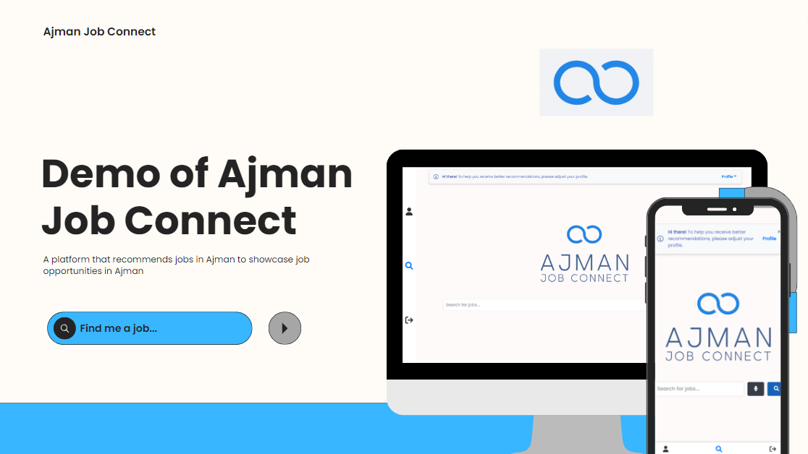
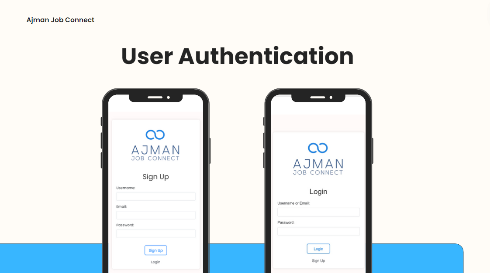
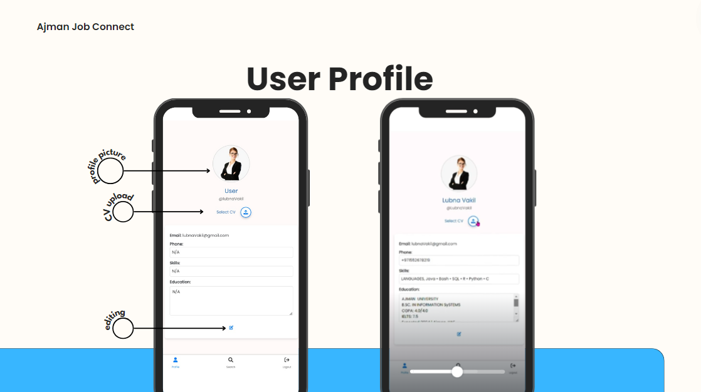

# Ajman Job Connect
<a href="https://app.commanddash.io/agent?github=https://github.com/MaryamAli-2020/ajman-job-connect"></a>

Ajman Job Connect is a web application that allows users to search for job recommendations based on text input or voice commands. It integrates a recommendation system that matches job titles with available opportunities from a MongoDB database.

## Features

- **Text Input Search:** Users can manually enter job titles to get recommendations.
- **Voice Input Search:** Users can use voice commands to search for job titles, which are transcribed and processed into recommendations.
- **Job Recommendations:** Displays job recommendations including title, description, company, location, and relevance score.
- **Responsive Design:** The web interface is designed to be responsive and user-friendly.

## Technologies Used

- **Frontend:** HTML, CSS, JavaScript (Vanilla JS)
- **Backend:** Python (Flask)
- **Database:** MongoDB
- **Libraries:** SpeechRecognition, pyttsx3, ffmpeg (for audio processing), pymongo, pandas, sentence-transformers

## Installation

1. Clone the repository:
```bash
   git clone https://github.com/MaryamAli-2020/ajman-job-connect.git
   cd ajman-job-connect
```

2. Run the build script:
```bash
   chmod +x build.sh
   ./build.sh
```

### Running the Application

1. Activate the virtual environment:
```bash
   source venv/bin/activate
 ```

3. Set up MongoDB:

Create a MongoDB database and collection.
Update the MONGO_URI in app.py with your MongoDB connection string.

3. Run the Flask application:
```bash
   python app.py
```

Open your web browser and navigate to http://localhost:5000 to use Ajman Job Connect.

## Usage

Enter a job title in the input field and click "Submit" to get job recommendations.
Click on the microphone button to start voice input. Speak a job title, and the application will transcribe your speech, display it, and fetch job recommendations based on the transcribed text.
View personalized job recommendations and update your profile for better matches.


## Acknowledgments

- Inspired by the job search functionality of popular job boards.
- Special thanks to the Ajman government for their support.

## Results

| App | Authentication Page |
|-----|---------------------|
|  |  |

| Recommendation Generation | Profile Page |
|---------------------------|--------------|
|  |  |


